# Template Setup Guide

This guide walks you through setting up a project created from the `claude-code-flow` template.

> **You are here because**: You clicked *Use this template* and created a new project. Now you need to configure it for development.

## Table of Contents

- [Prerequisites](#prerequisites)
  - [GitHub CLI Setup](#github-cli-setup)
  - [Python Environment Setup (UV)](#python-environment-setup-uv)
  - [Branch Protection Setup](#branch-protection-setup)
  - [GitHub Labels](#github-labels)
- [Workflow Setup Guide](#workflow-setup-guide)
  - [Step 1: Verify Directory Structure](#step-1-verify-directory-structure)
  - [Step 2: Git Configuration (Optional)](#step-2-git-configuration-optional)
  - [Step 3: Configure Hooks](#step-3-configure-hooks)
- [Important: Command Caching Behavior](#important-command-caching-behavior)
- [Setting Up Claude PR Reviews](#setting-up-claude-pr-reviews)
- [Command Reference](#command-reference)
- [Claude Memory System](#claude-memory-system)
- [Step-by-Step Development Workflow](#step-by-step-development-workflow)
- [Ralph Autonomous Development](#ralph-autonomous-development)
  - [How Ralph Works](#how-ralph-works)
  - [How Ralph Prioritizes Issues](#how-ralph-prioritizes-issues)
  - [Using Ralph with Live Monitor](#using-ralph-with-live-monitor)
  - [Dry-Run Mode](#dry-run-mode)
  - [Reset Commands](#reset-commands)
  - [Dashboard Theme & Appearance](#dashboard-theme--appearance)
  - [Why Custom Command Over Official Plugin?](#why-custom-command-over-official-plugin)
- [Next Steps](#next-steps)

---

## Prerequisites

Before setting up the workflow, ensure you have:

1. **Git repository** - New or existing, with a GitHub remote configured
2. **GitHub CLI** - See [GitHub CLI Setup](#github-cli-setup) below
3. **Claude Code** - Installed and configured

### GitHub CLI Setup

The workflow uses the GitHub CLI (`gh`) for issue and PR management. This is required for commands like [/create_plan](../.claude/commands/create_plan.md), [/describe_pr](../.claude/commands/describe_pr.md), and others that interact with GitHub.

#### Install GitHub CLI

Download and install from https://cli.github.com or use your package manager, e.g.:

```bash
# Ubuntu/Debian
sudo apt install gh
```

Verify installation:
```bash
gh --version
```

#### Authenticate GitHub CLI

```bash
# Start interactive authentication
gh auth login
```

Follow the prompts to:
1. Select `GitHub.com`
2. Choose your preferred protocol (SSH recommended)
3. Authenticate via browser or token

Verify authentication:
```bash
gh auth status
```

You should see output showing your account and token scopes including `repo`.

### Python Environment Setup (UV)

> **Note:** This section is specific to Python projects and serves as an example of setting up a language environment and package manager. If you're building with a different language, you'd follow similar steps with your language's tooling (e.g., `npm`/`pnpm` for JavaScript/TypeScript, `cargo` for Rust, `go mod` for Go). **Skip this section if you're not using Python.**

The workflow hooks use Python tools like `ruff` for auto-formatting and linting. We recommend [UV](https://docs.astral.sh/uv/) - a fast, modern Python package manager written in Rust that's 10-100x faster than pip.

> **Note:** This template includes a [.python-version](../.python-version) file (set to `3.12`) that UV and other Python version managers (pyenv, asdf) respect. UV will automatically use this Python version when creating virtual environments.

#### 1. Check if UV is Installed

```bash
which uv && uv --version || echo "UV not installed"
```

#### 2. Install or Update UV

**If UV is not installed:**
```bash
# Install uv (Linux/macOS)
curl -LsSf https://astral.sh/uv/install.sh | sh
```

**If UV is already installed, update to latest:**
```bash
uv self update
```

#### 3. Initialize Python Environment

In your project directory:

```bash
# Initialize a new Python project (creates pyproject.toml and .venv)
uv init

# Or if pyproject.toml already exists, just sync
uv sync
```

#### 4. Add Ruff for Auto-Formatting and Linting

Install the Python formatter and linter used by the auto-format hooks:

```bash
# Add ruff as a dev dependency
uv add ruff --dev
```

#### 5. Verify Ruff is Installed

```bash
uv run ruff --version
```

#### Using UV

UV automatically manages virtual environments. You don't need to activate them manually:

```bash
# Run any command in the virtual environment
uv run ruff format myfile.py
uv run python script.py

# Add more packages
uv add requests
uv add pytest --dev
```

If you prefer activating the environment manually (traditional workflow):
```bash
source .venv/bin/activate
ruff --version
```

### Branch Protection Setup

**Configure branch protection before starting development work.** This enforces the feature branch + PR workflow and prevents accidental commits directly to main.

#### Why Protect Main?

Branch protection ensures:
- All changes go through pull requests with code review
- CI/CD checks (tests, linting) pass before merging
- Clear audit trail of what changed, why, and who approved it
- Safety net preventing accidental force pushes or breaking changes

#### Check if Main Branch Exists

**Important:** In a new repository, the main branch doesn't exist until you make your first commit.

```bash
# Check if main branch exists
git branch -a | grep main
```

If you see `main` or `origin/main`, the branch exists. If not, create it:

```bash
# Option 1: If you have commits but no main branch yet
# (e.g., you started on a feature branch)
git branch main HEAD
git push -u origin main

# Option 2: If this is a brand new empty repo
# Create an initial commit first
git add README.md
git commit -m "Initial commit"
git branch -M main
git push -u origin main
```

Set main as the default branch (if not already):
```bash
gh repo edit --default-branch main
```

#### Configure Branch Protection Rules

Once main exists, configure protection rules via GitHub CLI:

```bash
# Create branch protection with PR requirements
# Replace YOUR_USERNAME/YOUR_REPO_NAME with your actual repo:
gh api repos/YOUR_USERNAME/YOUR_REPO_NAME/branches/main/protection \
  --method PUT \
  --input - <<EOFINNER
{
  "required_status_checks": null,
  "enforce_admins": true,
  "required_pull_request_reviews": {
    "required_approving_review_count": 1,
    "dismiss_stale_reviews": true,
    "require_code_owner_reviews": false
  },
  "restrictions": null
}
EOFINNER
```

**Note:** For solo projects, you can set `"required_approving_review_count": 0` to allow self-merge (still requires PR, but no approval needed).

**Or configure via GitHub UI:**

1. Go to your repository on GitHub
2. Navigate to **Settings** → **Branches**
3. Under "Branch protection rules", click **Add rule** (or edit existing rule)
4. For "Branch name pattern", enter: `main`
5. Enable these settings:
   - ✅ **Require a pull request before merging**
     - Require approvals: 1 (or 0 for solo projects to allow self-merge)
     - ✅ Dismiss stale pull request approvals when new commits are pushed
   - ✅ **Do not allow bypassing the above settings**
6. Click **Create** or **Save changes**

#### Verify Branch Protection

```bash
# Check protection status
gh api repos/YOUR_USERNAME/YOUR_REPO_NAME/branches/main/protection

# Or use placeholders (auto-filled from current repo)
gh api repos/:owner/:repo/branches/main/protection

# Or use GitHub UI: Settings → Branches → View rule details
```

You should see the main branch listed with a "Protected" badge.

#### Working with Protected Main

Once protected, you **cannot** push directly to main:

```bash
git push origin main
# remote: error: GH006: Protected branch update failed
```

Instead, all work must go through feature branches and pull requests (see [Feature Branch Workflow](#feature-branch-workflow) below).

#### Automatic Reviewer Assignment

**Ensure all PRs have reviewers assigned automatically** using a CODEOWNERS file. This works for PRs created manually, by Claude Code, or through automation.

> **Note:** For solo developers, CODEOWNERS is optional. If you're the only contributor and have `required_approving_review_count: 0` set in branch protection, you can skip this section. CODEOWNERS is primarily useful for teams or repositories that accept external contributions.

##### Why Auto-assign Reviewers?

- Ensures no PR is forgotten or left unreviewed
- Works consistently across all PR creation methods (CLI, Claude Code, GitHub Actions)
- Single source of truth for who reviews what
- Integrates seamlessly with GitHub's review workflow

##### Setup CODEOWNERS

Create [.github/CODEOWNERS](../.github/CODEOWNERS) to automatically request reviews:

```bash
# Create .github directory if it doesn't exist
mkdir -p .github

# Create CODEOWNERS file
cat > .github/CODEOWNERS << 'EOFINNER'
# CODEOWNERS
#
# Automatically request code review from repository owner for all changes.
# This ensures all PRs have a reviewer assigned, whether created manually
# via gh CLI, by Claude Code, or through GitHub Actions.

# Default owner for everything in the repo
* @YOUR_GITHUB_USERNAME
EOFINNER
```

**Replace `@YOUR_GITHUB_USERNAME` with your GitHub username.**

**How it works:**
- When any PR is created, GitHub automatically requests review from the specified user
- Applies to all files (`*` pattern) in the repository
- Works immediately—no additional configuration needed

### GitHub Labels

> **Required for workflow commands:** These labels must exist in your repository for both manual and autonomous workflows.

Labels track issue state through the workflow. Both manual commands (`/research_requirements`, `/create_plan`, `/implement_plan`) and Ralph autonomous script update labels automatically as work progresses.

| Label | Purpose | Color | Set by |
|-------|---------|-------|--------|
| `research-in-progress` | Research actively underway | Blue (`1d76db`) | `/research_requirements`, Ralph |
| `research-complete` | Research done, ready for planning | Green (`0e8a16`) | `/research_requirements`, Ralph |
| `planning-in-progress` | Plan being created | Yellow (`fbca04`) | `/create_plan`, Ralph |
| `ready-for-dev` | Has implementation plan, ready to build | Purple (`5319e7`) | `/create_plan`, Ralph, or manually |
| `in-progress` | Development actively underway | Red (`d93f0b`) | `/implement_plan`, Ralph |
| `validation-failed` | Implementation complete but failed validation | Light Purple (`d4c5f9`) | `/validate_plan`, Ralph |
| `implementation-failed` | Implementation could not be completed | Dark Red (`b60205`) | Ralph |
| `pr-submitted` | PR created, awaiting review | Light Green (`c2e0c6`) | `/describe_pr`, Ralph |
| `ralph-exempt` | Reserved for human-only work, skipped by Ralph | Gray (`6a737d`) | Manual only |
| `blocked-by-#N` | Blocked by issue #N (dynamic label) | Any | Manual (see [Dependency Blocking](#dependency-blocking)) |

#### Creating the Labels

**Option 1: Ask Claude to create them**
```
Create the GitHub labels needed for Ralph autonomous workflow:
research-in-progress, research-complete, planning-in-progress,
ready-for-dev, in-progress, validation-failed, implementation-failed,
pr-submitted, ralph-exempt
```

**Option 2: Create manually via CLI**
```bash
gh label create "research-in-progress" --description "Research actively underway" --color "1d76db"
gh label create "research-complete" --description "Research done, ready for planning" --color "0e8a16"
gh label create "planning-in-progress" --description "Plan being created" --color "fbca04"
gh label create "ready-for-dev" --description "Has implementation plan, ready to build" --color "5319e7"
gh label create "in-progress" --description "Development actively underway" --color "d93f0b"
gh label create "validation-failed" --description "Implementation complete but failed validation" --color "d4c5f9"
gh label create "implementation-failed" --description "Implementation could not be completed" --color "b60205"
gh label create "pr-submitted" --description "PR created, awaiting review" --color "c2e0c6"
gh label create "ralph-exempt" --description "Reserved for human-only work, skipped by Ralph" --color "6a737d"
```

**Note:** `blocked-by-#N` labels are created dynamically as needed (e.g., `blocked-by-#42`). You don't need to pre-create them.

**Option 3: Create via GitHub UI** - Settings → Labels → New label

#### How Ralph Uses Labels

**Workflow state labels:**
```bash
# Find issues ready for implementation
gh issue list --label "ready-for-dev" --json number,title

# Move issue to next state
gh issue edit 42 --add-label "in-progress" --remove-label "ready-for-dev"
```

**Control labels:**
```bash
# Exempt issue from Ralph (human-only work)
gh issue edit 42 --add-label "ralph-exempt"

# Block issue #42 until issue #30 is complete
gh issue edit 42 --add-label "blocked-by-#30"

# Remove block after blocker is resolved (or Ralph auto-removes when blocker closes)
gh issue edit 42 --remove-label "blocked-by-#30"
```

**View prioritized queue:**
```bash
# See how Ralph will process open issues
./scripts/ralph-autonomous.sh --priorities
```

**Manual workflow:** You can move issues through states manually by adding/removing labels in GitHub UI. Ralph will pick up from wherever the issue is.

---

## Workflow Setup Guide

This section guides you through configuring the Claude Code workflow for your project.

### Step 1: Verify Directory Structure

After creating from the template, your project will have this structure:

**Directory Structure:**

```
your-project/
├── .claude/
│   ├── commands/           # Claude Code slash commands
│   ├── skills/             # Reusable skill definitions
│   └── settings.json       # Hooks configuration
├── .ralph/
│   ├── state/              # Ralph autonomous state tracking
│   ├── active/             # Per-issue logs and feedback
│   └── archived/           # Archived issue logs
├── flow/
│   ├── research/           # Research output documents (empty)
│   ├── plans/              # Implementation plans (empty)
│   └── prs/                # PR descriptions (empty)
├── docs/
│   └── TEMPLATE_INSTRUCTIONS.md
├── .github/
│   ├── workflows/
│   │   └── claude.yml      # Claude Code PR review automation
│   ├── PULL_REQUEST_TEMPLATE.md
│   └── CODEOWNERS
├── scripts/
│   ├── ralph-autonomous.sh # Autonomous loop script
│   ├── ralph_monitor.sh    # Real-time monitoring dashboard
│   └── reset-ralph-state.sh # Reset Ralph state utility
├── .tmux/
│   └── scripts/
│       └── ralph_runtime.sh # Tmux runtime helper for Ralph monitor
├── .tmux.ralph.conf        # Monitoring dashboard config
├── .python-version         # Python version (UV respects this)
├── CONTRIBUTING.md         # Modify for your project's contribution guidelines
├── LICENSE                 # Modify for your project's license
├── README.md               # Replace with your project documentation
└── CLAUDE.md               # Claude Code instructions
```

**Key Files:**
- [.claude/settings.json](../.claude/settings.json) - Hooks configuration
- [.github/workflows/claude.yml](../.github/workflows/claude.yml) - Claude Code PR review automation
- [.github/PULL_REQUEST_TEMPLATE.md](../.github/PULL_REQUEST_TEMPLATE.md) - PR template
- [.github/CODEOWNERS](../.github/CODEOWNERS) - Auto-assign reviewers
- [scripts/ralph-autonomous.sh](../scripts/ralph-autonomous.sh) - Autonomous loop script
- [scripts/ralph_monitor.sh](../scripts/ralph_monitor.sh) - Real-time monitoring dashboard
- [scripts/reset-ralph-state.sh](../scripts/reset-ralph-state.sh) - Reset Ralph state utility
- [.tmux/scripts/ralph_runtime.sh](../.tmux/scripts/ralph_runtime.sh) - Tmux runtime helper
- [.tmux.ralph.conf](../.tmux.ralph.conf) - Monitoring dashboard config
- [.python-version](../.python-version) - Python version specification
- [CONTRIBUTING.md](../CONTRIBUTING.md) - Contribution guidelines
- [LICENSE](../LICENSE) - Project license
- [README.md](../README.md) - Project documentation
- [CLAUDE.md](../CLAUDE.md) - Claude Code instructions
- [docs/TEMPLATE_INSTRUCTIONS.md](../docs/TEMPLATE_INSTRUCTIONS.md) - This file

**What's missing?** Your source code! Add:
- `src/` or your preferred code directory
- `tests/` or your preferred test location
- `pyproject.toml`, `package.json`, or your dependency file
- Build/run scripts specific to your project

---

### Step 2: Git Configuration (Optional)

You can choose whether to track `flow/` in version control:

**Option A: Track flow for team collaboration**
```bash
# Add and commit the flow directory
git add flow/
git commit -m "Add flow directory for workflow artifacts"
```

**Option B: Exclude flow from version control**
```bash
# Add to .gitignore
echo "flow/" >> .gitignore
```

---

### Step 3: Configure Hooks

Claude Code hooks automate common tasks and protect sensitive files. The hooks configuration lives in [.claude/settings.json](../.claude/settings.json).

### What the Hooks Do

| Hook Type | Trigger | Purpose |
|-----------|---------|---------|
| **PreToolUse** | Before Edit/Write | Blocks modifications to sensitive files (.env, credentials, secrets, .git/) |
| **PostToolUse** | After Edit/Write | Auto-formats JS/TS files with Prettier, Python files with Ruff |
| **Notification** | When Claude needs input | Desktop notification (Linux `notify-send`) |

### Why These Hooks Matter

1. **Security**: The PreToolUse hook prevents accidental exposure of secrets by blocking edits to sensitive files. Claude will be stopped before it can write to `.env`, `credentials.json`, or similar files.

2. **Code Quality**: Auto-formatting ensures consistent code style without manual intervention. Every file edit is automatically formatted according to project standards.

3. **Workflow**: Desktop notifications alert you when Claude needs your attention, useful during long-running operations.

### Prerequisites for Hooks

The auto-format hooks require formatters to be installed. If you followed [Python Environment Setup (UV)](#python-environment-setup-uv), ruff is already installed.

```bash
# Python formatting and linting (already done if you followed UV setup)
uv add ruff --dev

# JavaScript/TypeScript formatting (if needed)
npm install --save-dev prettier
```

If these tools aren't installed, the hooks will silently skip formatting (they won't cause errors).

### Testing the Hooks

After configuring hooks, **restart your Claude Code session** for changes to take effect.

#### Test PreToolUse (File Protection)

Ask Claude to create a `.env` file:

```
Create a .env file with TEST_VAR=hello
```

**Expected result**: Claude should be blocked with an error:
```
PreToolUse:Write hook error: [python3 -c "..."]: No stderr output
```

#### Test PostToolUse (Auto-Formatting)

Ask Claude to create a badly formatted Python file:

```
Create a file called test_format.py with this exact content:
def ugly(x,y,z):return x+y+z
```

**Expected result**: The file is created and automatically formatted by ruff:
```python
def ugly(x, y, z):
    return x + y + z
```

You can verify by reading the file - it should be properly formatted despite the ugly input.

#### Test Notification Hook

The notification hook alerts you when Claude needs attention. The default configuration tries Linux first, then falls back to WSL/Windows.

Test notifications manually:
```bash
# Linux
notify-send 'Claude Code' 'Test notification'

# WSL/Windows
powershell.exe -Command "[System.Windows.Forms.MessageBox]::Show('Test','Claude Code')"

# macOS
osascript -e 'display notification "Test" with title "Claude Code"'
```

**Expected result**: A desktop notification or message box appears.

### Customizing Hooks

Edit [.claude/settings.json](../.claude/settings.json) to customize:

- **Add file types**: Extend the PostToolUse patterns for other languages
- **Change formatters**: Replace Prettier/Ruff with your preferred tools
- **Adjust blocked files**: Modify the PreToolUse blocked list for your project
- **Change notifications**: Replace with platform-specific command (see test examples above)

---

## Important: Command Caching Behavior

Claude Code loads command files ([.claude/commands/](../.claude/commands/)*.md) into memory when a session starts. This means:

**If you edit a command file during a session, the changes won't take effect until you restart Claude Code.**

This applies to:
- Creating new commands
- Modifying existing commands
- Renaming or deleting commands

### Symptoms of Stale Cache

If you edit a command and it still behaves the old way:
- The Skill tool loaded the in-memory (stale) version
- Your file edits are correct on disk but not loaded

### Solution

Restart your Claude Code session after modifying any files in [.claude/commands/](../.claude/commands/).

```bash
# Exit Claude Code (Ctrl+C or /exit)
# Then restart it
claude
```

This ensures all command files are freshly loaded from disk.

---

## Setting Up Claude PR Reviews

Enable Claude to review pull requests and improve [CLAUDE.md](../CLAUDE.md) over time by setting up the GitHub Action.

### Step 1: Workflow File (Already Included)

The workflow file [.github/workflows/claude.yml](../.github/workflows/claude.yml) is already included in this template. It triggers when @claude is mentioned in issues or PR comments.

#### Workflow Permissions

The workflow is configured with **write permissions**:

| Permission | Level | Purpose |
|------------|-------|---------|
| `contents` | write | Commit updates to [CLAUDE.md](../CLAUDE.md) and other files |
| `pull-requests` | write | Comment on PRs, suggest changes |
| `issues` | write | Respond to issue comments |
| `id-token` | write | Authentication with GitHub |

**Why write access?** The feedback loop requires Claude to commit improvements to [CLAUDE.md](../CLAUDE.md) directly. Without write access, Claude could only suggest changes in comments, losing the automated improvement cycle.

#### CLAUDE.md Update Instructions

The workflow includes a prompt that instructs Claude to consider updating [CLAUDE.md](../CLAUDE.md) when it notices:
- Recurring mistakes or anti-patterns
- Project conventions worth documenting
- Corrections to existing instructions

Claude will propose changes and commit them upon user approval.

### Step 2: Set Up OAuth Token

The workflow uses your Claude Code Max subscription via an OAuth token. Set it up using the built-in Claude Code command:

```bash
/install-github-app
```

**What this does:**
- Authenticates your GitHub account with Claude Code
- Creates a `CLAUDE_CODE_OAUTH_TOKEN` secret in your repository
- Enables Claude to respond to @mentions in PRs and issues

**After running the command:**
1. Follow the prompts to authorize Claude Code with GitHub
2. Select your repository when prompted
3. The token is automatically configured as a repository secret

> **Note:** This uses your Claude Code Max subscription, not a separate Anthropic API key. The workflow is already configured to use `claude_code_oauth_token` in [.github/workflows/claude.yml](../.github/workflows/claude.yml).

### Step 3: Test the Workflow

Once the OAuth token is configured, test that @claude mentions work:

1. Create a test PR (or use an existing one)
2. Add a comment mentioning @claude:
   ```
   @claude Hello! Please confirm the workflow is working.
   ```
3. Watch for:
   - 👀 emoji appears (Claude sees the mention)
   - GitHub Action runs (check Actions tab)
   - Claude responds with a comment

---

## Command Reference

The workflow provides these commands organized by phase:

### Research Phase

| Command | Purpose |
|---------|---------|
| [/research_requirements](../.claude/commands/research_requirements.md) | Research requirements and tech choices for new features |
| [/research_codebase](../.claude/commands/research_codebase.md) | Document existing codebase patterns and architecture |

### Planning Phase

| Command | Purpose |
|---------|---------|
| [/create_plan](../.claude/commands/create_plan.md) | Create detailed implementation plans with phased approach |
| [/iterate_plan](../.claude/commands/iterate_plan.md) | Update existing plans based on new requirements |

### Implementation Phase

| Command | Purpose |
|---------|---------|
| [/implement_plan](../.claude/commands/implement_plan.md) | Execute plans phase by phase with verification checkpoints |
| [/validate_plan](../.claude/commands/validate_plan.md) | Validate implementation matches plan (quality gate before commit) |

### Commit & PR Phase

| Command | Purpose |
|---------|---------|
| [/commit](../.claude/commands/commit.md) | Create git commits with user approval |
| [/autonomous_commit](../.claude/commands/autonomous_commit.md) | Create commits without approval (for autonomous workflows) |
| [/describe_pr](../.claude/commands/describe_pr.md) | Generate comprehensive PR descriptions from templates |
| [/handle_pr_feedback](../.claude/commands/handle_pr_feedback.md) | Handle @claude PR review feedback - update plan and implement changes |

### Autonomous Workflow

| Script | Purpose |
|--------|---------|
| [ralph-autonomous.sh](../scripts/ralph-autonomous.sh) | Autonomous issue processing loop with monitoring (Research → Plan → Implement → Validate → PR → Review → Merge) |

### Session Management

| Command | Purpose |
|---------|---------|
| [/create_handoff](../.claude/commands/create_handoff.md) | Create handoff document for transferring work to another session |
| [/resume_handoff](../.claude/commands/resume_handoff.md) | Resume work from handoff document with context |

**Typical workflow:**

**Greenfield (new features):**

[/research_requirements](../.claude/commands/research_requirements.md) → [/create_plan](../.claude/commands/create_plan.md) → [/implement_plan](../.claude/commands/implement_plan.md) → [/validate_plan](../.claude/commands/validate_plan.md) → [/commit](../.claude/commands/commit.md) → Push & PR → [/describe_pr](../.claude/commands/describe_pr.md) → Review → [/handle_pr_feedback](../.claude/commands/handle_pr_feedback.md) (if needed)

**Brownfield (existing codebase):**

[/research_codebase](../.claude/commands/research_codebase.md) → [/create_plan](../.claude/commands/create_plan.md) → [/implement_plan](../.claude/commands/implement_plan.md) → [/validate_plan](../.claude/commands/validate_plan.md) → [/commit](../.claude/commands/commit.md) → Push & PR → [/describe_pr](../.claude/commands/describe_pr.md) → Review → [/handle_pr_feedback](../.claude/commands/handle_pr_feedback.md) (if needed)

---

## Claude Memory System

Claude Code maintains a **persistent memory** system that allows Claude to learn from experience across conversations. Memory files are stored in `~/.claude/projects/<project-path>/memory/` and are automatically loaded into Claude's system prompt in future sessions.

### MEMORY.md

The main memory file that persists learnings across all conversations in this project:

- **Location**: `~/.claude/projects/<project-path>/memory/MEMORY.md`
- **Access**: Use Read/Edit/Write tools on this file path
- **Limit**: Keep under 200 lines (longer content truncated)
- **Purpose**: Record critical lessons, patterns, and gotchas that should inform all future work

**Example use case**: After encountering issues during the thoughts→flow rename operation, we documented:
- Always use feature branches (never work directly on main)
- Use multiple grep patterns for find/replace operations (not just paths)
- Run comprehensive verification BEFORE committing (not after)
- Git stash doesn't preserve renames properly

These lessons are now permanently in Claude's system prompt for this project, preventing the same mistakes in future sessions.

### Topic-Specific Memory Files

For detailed information that would exceed the 200-line limit, create separate topic files:

- **Example**: `memory/rename-operations.md` - Detailed checklist for rename operations
- **Link from MEMORY.md**: Keep MEMORY.md concise and link to detailed topic files
- **Organization**: Organize by topic, not chronologically

### When to Update Memory

Add to memory when you:
- ✅ Encounter a significant mistake with clear lessons learned
- ✅ Discover a non-obvious pattern or constraint in the codebase
- ✅ Find a solution to a tricky problem that could recur
- ✅ Identify a workflow improvement or process refinement

Don't add to memory:
- ❌ Obvious or well-documented information
- ❌ Project-specific details that belong in CLAUDE.md
- ❌ Temporary workarounds that will be fixed
- ❌ Personal preferences without clear rationale

### Editing Memory

```bash
# View current memory
cat ~/.claude/projects/<project-path>/memory/MEMORY.md

# Edit in conversation
# Simply use the Edit or Write tool with the full path
```

Claude can read and update memory files during any conversation. Changes are immediately reflected and will be loaded in the next session.

---

## Step-by-Step Development Workflow

> **Note:** If using [ralph-autonomous.sh](../scripts/ralph-autonomous.sh) for autonomous workflow, branch creation and the full workflow are handled automatically. This section is for manual step-by-step development.

```mermaid
%%{init: {'theme':'base', 'themeVariables': { 'fontSize':'15px','fontFamily':'system-ui, -apple-system, sans-serif'}}}%%
flowchart TD
    Start([Create GitHub Issue]) --> Branch[🌿 Create Feature Branch]
    Branch --> Research{New Feature or<br/>Existing Codebase?}

    Research -->|New| ResReq["📋 research_requirements<br/><i>Explore requirements</i>"]
    Research -->|Existing| ResCB["🔎 research_codebase<br/><i>Understand patterns</i>"]

    ResReq --> Plan["📝 create_plan<br/><i>Design approach</i>"]
    ResCB --> Plan

    Plan --> Implement["implement_plan<br/><i>Build features</i>"]
    Implement --> Validate["✓ validate_plan<br/><i>Quality check</i>"]

    Validate -->|❌ Failed| Implement
    Validate -->|✅ Passed| Commit["💾 commit<br/><i>Save changes</i>"]

    Commit --> Push["Push Branch"]
    Push --> CreatePR["Create Draft PR<br/><i>gh pr create --draft</i>"]
    CreatePR --> DescribePR["📄 describe_pr<br/><i>Generate description</i>"]
    DescribePR --> Ready["Mark PR Ready<br/><i>gh pr ready</i>"]

    Ready --> Review{"🤖 @claude<br/>Review"}

    Review -->|✅ Approved| Merge["🎉 Merge PR"]
    Review -->|🔄 Changes<br/>Requested| Feedback["🔧 handle_pr_feedback<br/><i>Update plan & implement</i>"]

    Feedback --> Review

    Merge --> Done([🏁 Issue Complete])

    %% Styling with color-coded phases
    style Start fill:#1a1a2e,stroke:#16213e,stroke-width:4px,color:#eee
    style Done fill:#0f3460,stroke:#16213e,stroke-width:4px,color:#eee

    style Research fill:#533483,stroke:#7b68a6,stroke-width:3px,color:#fff
    style ResReq fill:#2a4494,stroke:#5a7fc7,stroke-width:2px,color:#fff
    style ResCB fill:#2a4494,stroke:#5a7fc7,stroke-width:2px,color:#fff

    style Plan fill:#1e6f50,stroke:#4fa382,stroke-width:2px,color:#fff
    style Implement fill:#1e6f50,stroke:#4fa382,stroke-width:2px,color:#fff

    style Validate fill:#b8860b,stroke:#daa520,stroke-width:3px,color:#fff

    style Commit fill:#2f4f4f,stroke:#5a7d7d,stroke-width:2px,color:#fff
    style Push fill:#2f4f4f,stroke:#5a7d7d,stroke-width:2px,color:#fff

    style CreatePR fill:#4a4a6a,stroke:#7272a8,stroke-width:2px,color:#fff
    style DescribePR fill:#4a4a6a,stroke:#7272a8,stroke-width:2px,color:#fff
    style Ready fill:#4a4a6a,stroke:#7272a8,stroke-width:2px,color:#fff

    style Review fill:#8b3a62,stroke:#b85c8a,stroke-width:3px,color:#fff
    style Feedback fill:#704e3d,stroke:#9d7050,stroke-width:2px,color:#fff

    style Merge fill:#0f5132,stroke:#198754,stroke-width:3px,color:#fff
```



### For New Features (Greenfield)

```bash
# 1. Create GitHub issue first
gh issue create --title "Add feature X" --body "Description..."
# Tip: Ask Claude to help draft the issue title and description

# 2. Create feature branch immediately
git checkout -b feature/42-add-feature-x

# 3. Research requirements
/research_requirements #42

# 4. Create implementation plan
/create_plan flow/research/2026-02-03-gh-42-add-feature-x.md

# 5. Implement the plan
/implement_plan flow/plans/2026-02-03-gh-42-add-feature-x.md

# 6. Validate implementation
/validate_plan flow/plans/2026-02-03-gh-42-add-feature-x.md

# 7. Commit changes
/commit
# Tip: Claude will create well-formatted commits following the repository's conventions

# 8. Push feature branch to remote
git push -u origin feature/42-add-feature-x

# 9. Create draft PR (merges feature branch INTO main)
gh pr create --base main --draft
# --base main: Target branch to merge INTO (main is protected, requires PRs)
# --draft: Keeps PR in draft mode until description is ready
# Note: Source branch is your current branch (feature/42-add-feature-x)
# This creates: feature/42-add-feature-x → main

# 10. Generate comprehensive PR description
/describe_pr
# - Reads .github/PULL_REQUEST_TEMPLATE.md
# - Analyzes PR diff and commit history
# - Generates description following template
# - Runs verification commands (tests, linting)
# - Automatically UPDATES the existing draft PR via `gh pr edit`

# 11. Mark PR as ready for review
gh pr ready
# Or click "Ready for review" in GitHub UI
```

### For Existing Codebases (Brownfield)

```bash
# 1. Create GitHub issue first
gh issue create --title "Add new endpoint" --body "Description..."
# Tip: Ask Claude to help draft the issue title and description

# 2. Create feature branch immediately
git checkout -b feature/7-new-endpoint

# 3. Research the codebase
/research_codebase #7

# 4. Create implementation plan
/create_plan flow/research/2026-02-03-gh-7-new-endpoint.md

# 5. Implement the plan
/implement_plan flow/plans/2026-02-03-gh-7-new-endpoint.md

# 6. Validate implementation
/validate_plan flow/plans/2026-02-03-gh-7-new-endpoint.md

# 7. Commit changes
/commit
# Tip: Claude will create well-formatted commits following the repository's conventions

# 8. Push feature branch to remote
git push -u origin feature/7-new-endpoint

# 9. Create draft PR (merges feature branch INTO main)
gh pr create --base main --draft
# --base main: Target branch to merge INTO (main is protected, requires PRs)
# --draft: Keeps PR in draft mode until description is ready
# Note: Source branch is your current branch (feature/7-new-endpoint)
# This creates: feature/7-new-endpoint → main

# 10. Generate comprehensive PR description
/describe_pr
# - Reads .github/PULL_REQUEST_TEMPLATE.md
# - Analyzes PR diff and commit history
# - Generates description following template
# - Runs verification commands (tests, linting)
# - Automatically UPDATES the existing draft PR via `gh pr edit`

# 11. Mark PR as ready for review
gh pr ready
# Or click "Ready for review" in GitHub UI
```

### Creating a Pull Request

**Option 1: Via CLI**

```bash
# Create a draft PR (from current feature branch → main)
gh pr create --base main --title "Your PR title" --body "Description" --draft
# --base main: Merge INTO main (the protected target branch)
# Source: Your current feature branch (auto-detected)

# Or create PR ready for review immediately
gh pr create --base main --title "Your PR title" --body "Description"
```

**Option 2: Ask Claude Code**

```
Create a PR for this branch
```

Claude will use `gh pr create` and prompt you for title and description if needed.

### Using `/describe_pr`

> Implementation: [`.claude/commands/describe_pr.md`](../.claude/commands/describe_pr.md)

Generates comprehensive PR descriptions following this repository's template.

```
/describe_pr
```

**What it does:**
- Reads your PR template from [`.github/PULL_REQUEST_TEMPLATE.md`](../.github/PULL_REQUEST_TEMPLATE.md)
- Analyzes the full diff and commit history
- Runs verification commands (tests, linting) and marks checklist items
- Generates a thorough description filling all template sections
- Saves the description to `flow/prs/{number}_description.md`
- Updates the PR directly via `gh pr edit`

**Example workflow:**

```bash
# 1. Ensure you're on your feature branch
git checkout feature/42-add-feature-x

# 2. Create draft PR (merges feature branch → main)
gh pr create --base main --title "Add feature X" --body "WIP" --draft
# --base main: Target branch to merge INTO
# Source: Current branch (feature/42-add-feature-x)

# 3. Generate comprehensive description
/describe_pr
# Reads .github/PULL_REQUEST_TEMPLATE.md
# Analyzes diff, runs tests
# Automatically UPDATES the draft PR

# 4. PR is now updated with full description (still in draft)

# 5. Mark PR as ready for review (two options):
```

**Option 1: Via CLI**
```bash
gh pr ready <pr-number>
```

**Option 2: Via GitHub UI**
- Go to your PR page on GitHub
- Scroll to the bottom of the PR
- Click the green "Ready for review" button

**What it does NOT do:**
- Create the PR (use `gh pr create` or ask Claude first)
- Change draft status (PR remains draft until you mark it ready)
- Merge the PR
- Complete manual verification steps (leaves those unchecked for you)

### Using @claude in PR Reviews

After creating your PR, you can @mention Claude in PR comments to get code reviews, architectural feedback, and suggestions. Claude will respond directly in the PR using your Claude Code Max subscription.

**Example comments to try:**

```
@claude please review this PR
```
Standard review request - Claude will analyze the code and approve or request changes

```
@claude Please review this PR and approve it or request changes
```
Explicit approval/rejection request - useful for autonomous workflows

```
@claude Review this PR for code quality and potential issues
```

```
@claude What do you think about the architecture decisions in this PR?
```

```
@claude Suggest improvements to CLAUDE.md based on patterns you see
```

```
@claude Are there any edge cases we might have missed in the validation logic?
```

```
@claude Review this PR with a focus on security concerns
```

**What happens:**
1. You add a comment mentioning @claude
2. The GitHub Action triggers automatically
3. Claude reviews your code and responds with feedback
4. Claude may suggest updates to [CLAUDE.md](../CLAUDE.md) for future improvements

**Workflow integration:**

```bash
# After completing the development workflow (see Step-by-Step Development Workflow):
# - Implemented plan, committed changes
# - Pushed feature branch, created draft PR via gh pr create --base main --draft
# - Ran /describe_pr to generate comprehensive description

# Get Claude's review in the GitHub PR:
@claude Review this PR for code quality and potential issues

# Claude responds with feedback - see below for handling action items
```

### Handling @claude Feedback

When @claude reviews your PR and suggests changes, you have two options:

**Option 1: Automated (Recommended)** - Use `/handle_pr_feedback`:

```bash
/handle_pr_feedback 42
# Or auto-detect PR from current branch:
/handle_pr_feedback
```

This automatically:
- Fetches @claude's review feedback
- Updates the implementation plan with "PR Review Updates" section
- Implements the requested changes
- Runs tests
- Commits and pushes
- Requests re-review from @claude

See [/handle_pr_feedback](../.claude/commands/handle_pr_feedback.md) for details.

> **Why update plans?** Implementation plans serve as living documentation of what was built and why. When @claude's review reveals issues or better approaches, these insights should be captured in the plan so it reflects reality, not just original intent. This is especially important for future reference and understanding the evolution of the implementation.

**Option 2: Manual** - Handle feedback manually:

#### 1. Review Claude's Feedback
- Read through all comments and suggestions
- Decide which feedback to address (you're the human - final call is yours)
- Prioritize critical issues (security, bugs) over suggestions (style, optimizations)

#### 2. Make Changes on the Feature Branch
Stay on your feature branch and make the recommended changes:

```bash
# Ensure you're on the correct branch
git checkout feature/your-branch-name

# Make changes to address feedback
# Option A: Edit files manually in your editor
# Option B: Ask Claude Code directly in the CLI:
#   "Fix the SQL injection issue @claude mentioned in the PR review"
#   "Address the null check feedback from the PR review"
```

#### 3. Update the Implementation Plan

Update your plan file to document the changes:

```bash
# Find your plan file
ls flow/plans/*-gh-<issue-number>-*.md

# Update the plan with PR Review Updates section
# Add what changed and why based on @claude's feedback
```

Or ask Claude to update it:
```
Update the implementation plan at flow/plans/<file>.md to document the PR feedback changes:
- What @claude suggested
- What was changed
- Why it matters
```

#### 4. Commit and Push Updates
```bash
# Commit your changes AND the updated plan
git add <changed-files> flow/plans/<plan-file>.md
git commit -m "Address @claude feedback: <describe what you fixed>"

# Push to update the PR
git push
```

The PR automatically updates with your new commits.

#### 5. (Optional) Ask Claude to Verify
After making changes, you can ask Claude to verify:

```
@claude I've addressed your feedback in the latest commit. Can you verify the changes?
```

#### 5. Iterate Until Ready
Repeat steps 2-4 until all critical feedback is addressed. Then merge the PR.

**Example interaction:**
```
You: @claude Review this PR for security concerns

Claude: Found potential SQL injection in auth.py:42.
        Recommend using parameterized queries instead of string concatenation.

You: [Makes changes, commits, pushes]

You: @claude I've fixed the SQL injection issue. Please verify.

Claude: ✅ Looks good! The parameterized query properly prevents SQL injection.

You: [Merges PR]
```

**Important notes:**
- **Don't create new PRs for feedback** - update the existing branch
- **Don't squash commits prematurely** - keep feedback commits separate for clarity
- **Use descriptive commit messages** - reference what feedback you're addressing
- **Claude sees the full PR history** - it can track what changed between reviews

> **Tip:** Ask Claude to review with [CLAUDE.md](../CLAUDE.md) improvements in mind. This creates a feedback loop where each PR review can make your workflow better over time. When all good, ask Claude to merge the PR.

---

## Ralph Autonomous Development

For fully autonomous multi-issue processing, use the `ralph-autonomous.sh` shell script. This provides a production-ready autonomous workflow with live monitoring, state management, and retry logic.

**About Ralph:** The [Ralph Wiggum technique](https://ghuntley.com/ralph/) is an AI development methodology created by Geoffrey Huntley that runs coding agents in a continuous loop until all tasks are complete. Named after the Simpsons character known for being simple but persistent.

### How Ralph Works

```mermaid
%%{init: {'theme':'base', 'themeVariables': { 'fontSize':'14px','fontFamily':'system-ui, -apple-system, sans-serif'}}}%%
flowchart TD
    Start([🤖 Ralph Starts]) --> OuterLoop{Outer Loop<br/>Issue #1-10}

    OuterLoop -->|Next Issue| Select["🎯 Select Next Issue<br/><i>6-Stage Prioritization</i>"]

    Select --> CheckQueue{Issues<br/>Available?}
    CheckQueue -->|No| AllDone([✅ All Issues Complete])
    CheckQueue -->|Yes| CheckCircuit{Circuit<br/>Breaker?}

    CheckCircuit -->|OPEN| Halted([⛔ Halted<br/><i>Fix issues & reset</i>])
    CheckCircuit -->|CLOSED| InnerLoop["⟳ Inner Loop<br/>Attempt 1-10"]

    InnerLoop --> Research["📋 Research Phase<br/><i>/research_codebase</i>"]
    Research -->|Missing| CreateResearch["Create research doc"]
    Research -->|Exists| Plan
    CreateResearch --> Plan["📝 Plan Phase<br/><i>/create_plan</i>"]

    Plan -->|Missing| CreatePlan["Create implementation plan"]
    Plan -->|Exists| Branch
    CreatePlan --> Branch["🌿 Create Feature Branch<br/><i>feature/N-title</i>"]

    Branch --> Implement["⚙️ Implement Phase<br/><i>/implement_plan</i>"]

    Implement -->|Success| Validate["✓ Validate Phase<br/><i>/validate_plan</i>"]
    Implement -->|Timeout/Error| CheckAttempts

    Validate -->|✅ Passed| Commit["💾 Commit & Push<br/><i>/autonomous_commit</i>"]
    Validate -->|❌ Failed| CheckAttempts{Attempts<br/>< 10?}

    CheckAttempts -->|Yes| RetryFresh["🔄 Retry with Fresh Session<br/><i>Compressed feedback</i>"]
    RetryFresh --> InnerLoop
    CheckAttempts -->|No| Failed["❌ Mark Failed<br/><i>Label: implementation-failed</i>"]
    Failed --> OuterLoop

    Commit --> CreatePR["📄 Create PR<br/><i>gh pr create</i>"]
    CreatePR --> RequestReview["🤖 Request @claude Review"]

    RequestReview --> PollReview["⏱️ Poll Review Status<br/><i>10min timeout</i>"]
    PollReview --> ReviewDecision{Review<br/>Decision?}

    ReviewDecision -->|APPROVED| AutoMerge["🎉 Auto-Merge PR<br/><i>Squash & delete branch</i>"]
    ReviewDecision -->|CHANGES_REQUESTED| HandleFeedback["🔧 Handle PR Feedback<br/><i>/handle_pr_feedback</i>"]
    ReviewDecision -->|TIMEOUT| NeedsHuman["⚠️ Needs Human Review<br/><i>Label & continue</i>"]

    HandleFeedback --> ReviewIteration{Iteration<br/>< 3?}
    ReviewIteration -->|Yes| RequestReview
    ReviewIteration -->|No| NeedsHuman

    AutoMerge --> CloseIssue["✅ Close Issue<br/><i>Success comment</i>"]
    CloseIssue --> Archive["📦 Archive Logs<br/><i>.ralph/archived/YYYY-MM/</i>"]
    Archive --> OuterLoop

    NeedsHuman --> OuterLoop

    %% Styling - Outer loop
    style Start fill:#1a1a2e,stroke:#16213e,stroke-width:4px,color:#eee
    style OuterLoop fill:#4a1a5e,stroke:#6a2a7e,stroke-width:3px,color:#fff
    style AllDone fill:#0f5132,stroke:#198754,stroke-width:4px,color:#fff
    style Halted fill:#842029,stroke:#b02a37,stroke-width:4px,color:#fff

    %% Styling - Issue selection
    style Select fill:#1e6f50,stroke:#4fa382,stroke-width:2px,color:#fff
    style CheckQueue fill:#533483,stroke:#7b68a6,stroke-width:2px,color:#fff
    style CheckCircuit fill:#b8860b,stroke:#daa520,stroke-width:2px,color:#fff

    %% Styling - Inner loop
    style InnerLoop fill:#4a1a5e,stroke:#6a2a7e,stroke-width:3px,color:#fff
    style RetryFresh fill:#6a2a7e,stroke:#8a4a9e,stroke-width:2px,color:#fff

    %% Styling - Research & Plan
    style Research fill:#2a4494,stroke:#5a7fc7,stroke-width:2px,color:#fff
    style CreateResearch fill:#2a4494,stroke:#5a7fc7,stroke-width:2px,color:#fff
    style Plan fill:#2a4494,stroke:#5a7fc7,stroke-width:2px,color:#fff
    style CreatePlan fill:#2a4494,stroke:#5a7fc7,stroke-width:2px,color:#fff

    %% Styling - Implementation
    style Branch fill:#1e6f50,stroke:#4fa382,stroke-width:2px,color:#fff
    style Implement fill:#1e6f50,stroke:#4fa382,stroke-width:2px,color:#fff

    %% Styling - Validation
    style Validate fill:#b8860b,stroke:#daa520,stroke-width:2px,color:#fff
    style CheckAttempts fill:#b8860b,stroke:#daa520,stroke-width:2px,color:#fff

    %% Styling - Commit & PR
    style Commit fill:#2f4f4f,stroke:#5a7d7d,stroke-width:2px,color:#fff
    style CreatePR fill:#4a4a6a,stroke:#7272a8,stroke-width:2px,color:#fff

    %% Styling - Review process
    style RequestReview fill:#8b3a62,stroke:#b85c8a,stroke-width:2px,color:#fff
    style PollReview fill:#8b3a62,stroke:#b85c8a,stroke-width:2px,color:#fff
    style ReviewDecision fill:#8b3a62,stroke:#b85c8a,stroke-width:3px,color:#fff
    style HandleFeedback fill:#704e3d,stroke:#9d7050,stroke-width:2px,color:#fff
    style ReviewIteration fill:#704e3d,stroke:#9d7050,stroke-width:2px,color:#fff

    %% Styling - Success & cleanup
    style AutoMerge fill:#0f5132,stroke:#198754,stroke-width:2px,color:#fff
    style CloseIssue fill:#0f5132,stroke:#198754,stroke-width:2px,color:#fff
    style Archive fill:#2f4f4f,stroke:#5a7d7d,stroke-width:2px,color:#fff

    %% Styling - Failure states
    style Failed fill:#842029,stroke:#b02a37,stroke-width:2px,color:#fff
    style NeedsHuman fill:#d97706,stroke:#f59e0b,stroke-width:2px,color:#fff
```



**Legend:**
- **Purple nodes** = Loop controls (outer/inner)
- **Blue nodes** = Research & planning phases
- **Green nodes** = Implementation & git operations
- **Gold nodes** = Validation & quality gates
- **Pink/Brown nodes** = Review & feedback handling
- **Dark green nodes** = Success paths
- **Red nodes** = Failure states
- **Orange nodes** = Human intervention needed

Ralph automatically processes issues end-to-end:

1. **Selects next issue** using a multi-stage prioritization system:
   - **Stage 1: Fetch** - Retrieves up to 20 open issues from GitHub
   - **Stage 2: Filter Exemptions** - Excludes issues labeled `ralph-exempt` (reserved for human-only work)
   - **Stage 3: Filter Dependencies** - Checks for `blocked-by-#N` labels and skips issues with open blockers
   - **Stage 4: Score Priority** - Analyzes issue titles/descriptions for keywords to assign priority 1-5 (see [Priority Levels](#priority-levels) below)
   - **Stage 5: Sort** - Orders issues by: priority score (1=highest), has plan (`ready-for-dev`), has research (`research-complete`), issue number (older first)
   - **Stage 6: Select** - Picks the top issue from the sorted list
2. Creates research if missing ([/research_requirements](../.claude/commands/research_requirements.md))
3. Creates plan if missing ([/create_plan](../.claude/commands/create_plan.md))
4. Implements the plan ([/implement_plan](../.claude/commands/implement_plan.md))
5. Validates implementation ([/validate_plan](../.claude/commands/validate_plan.md))
6. Creates PR if validation passes
7. **Requests @claude review:**
   - Comments `@claude Please review this PR and approve it or request changes`
   - Polls for review completion (10 minute timeout)
   - If APPROVED → proceeds to merge
   - If CHANGES_REQUESTED → uses [/handle_pr_feedback](../.claude/commands/handle_pr_feedback.md):
     - Updates implementation plan with "PR Review Updates" section
     - Implements requested changes
     - Commits and pushes updates
     - Requests re-review
     - Up to 3 iterations, then labels `needs-human-review` if not approved
   - **Note:** Plan updates ensure documentation reflects reality, not just original intent
8. **Auto-merges approved PRs:**
   - Merges with squash and deletes branch
   - Closes issue with success comment
9. Moves to next issue

### How Ralph Prioritizes Issues

Ralph doesn't process issues in creation order. Instead, it uses a sophisticated multi-stage prioritization system implemented in [`scripts/ralph_priority.sh`](../scripts/ralph_priority.sh) and [`scripts/ralph_github.sh`](../scripts/ralph_github.sh).

#### Prioritization Pipeline

```
Open Issues (20)
    ↓
Filter: Remove ralph-exempt
    ↓
Filter: Remove blocked-by-#N (where #N is open)
    ↓
Score: Analyze keywords → Priority 1-5
    ↓
Sort: Priority, Has Plan, Has Research, Issue #
    ↓
Select: Top issue
```

#### Priority Levels

Ralph analyzes issue titles and descriptions to assign priority scores based on keyword matching:

| Priority | Type | Description | Keywords | Implementation |
|----------|------|-------------|----------|----------------|
| 1 | **Foundational** | Creates structure/setup that other work depends on | structure, setup, scaffold, foundation, infrastructure, base, initial, directory, layout | Checked first |
| 5 | **Testing** | Requires other work to be complete | test, testing, e2e, qa, playwright, jest, coverage | Checked second (lowest priority) |
| 3 | **Integration** | Connects components together | integrate, integration, connect, wire up, link, combine, streaming, real-time | Checked third |
| 4 | **Enhancement** | Improves existing functionality | improve, enhance, optimize, refactor, update, markdown, render | Checked fourth |
| 2 | **Feature** | Core implementation work (default) | implement, add, create, build, feature, api, client | Checked last + default fallback |

**Note:** Keywords are matched case-insensitively against both issue title and description. Lower priority number = higher priority (Priority 1 issues are worked on first).

#### Sort Criteria

After scoring, issues are sorted by multiple criteria in order of precedence:

1. **Priority score** (ascending: 1, 2, 3, 4, 5) - Foundational work comes first, testing last
2. **Has plan** - Issues with `ready-for-dev` label come before those without
3. **Has research** - Issues with `research-complete` label come before those without
4. **Issue number** (ascending) - Older issues come before newer ones

**Example sort order:**
```
#5  Priority 1 (Foundational) + ready-for-dev
#12 Priority 1 (Foundational) + research-complete
#3  Priority 1 (Foundational) - no labels
#8  Priority 2 (Feature) + ready-for-dev
#15 Priority 2 (Feature) + research-complete
#7  Priority 2 (Feature) - no labels
#22 Priority 5 (Testing) + ready-for-dev
```

#### Dependency Blocking

Ralph respects issue dependencies using GitHub labels:

**To block an issue:**
```bash
# Block issue #42 until issue #30 is complete
gh issue edit 42 --add-label "blocked-by-#30"
```

**How it works:**
- Ralph checks each issue for labels matching pattern `blocked-by-#N`
- If found, checks if blocker issue #N is still open
- If blocker is **open** → skips the blocked issue
- If blocker is **closed** → automatically removes the `blocked-by-#N` label and processes the issue

**Label format:** Must be exactly `blocked-by-#<number>` (e.g., `blocked-by-#42`, `blocked-by-#123`)

**View prioritized queue:**
```bash
./scripts/ralph-autonomous.sh --priorities
```

This displays all open issues sorted by Ralph's prioritization algorithm with visual indicators for research (📄) and plans (📋).

**Prerequisites:**
- GitHub labels must exist - see [GitHub Labels](#github-labels) above
- Branch protection configured (prevents direct commits to main) - see [Branch Protection Setup](#branch-protection-setup)

**Quality Gate:**
Ralph only creates commits and PRs for implementations that pass validation. Failed validations are flagged for human review rather than attempting automated fixes.

**Living Documentation:**
When @claude reviews PRs and requests changes, Ralph updates the implementation plan with a "PR Review Updates" section. This ensures plans remain accurate documentation of what was actually built, including insights discovered during review. Plans evolve with the code, not just capturing original intent.

### Using Ralph with Live Monitor

Launch Ralph with a live monitoring dashboard:

```bash
# Launch with live monitoring dashboard
./scripts/ralph-autonomous.sh --monitor

# The dashboard shows:
# - Left pane: Ralph execution logs (research, planning, implementation)
# - Right pane: Live status, task queue, API limits, recent activity
#
# Controls:
# - Ctrl+B then D: Detach (Ralph keeps running in background)
# - Ctrl+B then arrow keys: Switch between panes

# Later, check on progress
./scripts/ralph-autonomous.sh --status

# Or reattach to see live dashboard
tmux attach -t ralph-monitor-<session-id>

# Preview before running
./scripts/ralph-autonomous.sh --dry-run        # See what would happen without making changes
```

### Dry-Run Mode

**Dry-run mode** (`--dry-run`) is a preview mode that shows what Ralph would do without making any actual changes.

**What dry-run DOES:**
- ✅ Select issues from GitHub in priority order
- ✅ Go through all phases (Research → Plan → Implement → Validate → PR)
- ✅ Show `[DRY RUN] Would invoke...` log messages for each action
- ✅ Update monitor status files (if using `--monitor`)
- ✅ Complete the full loop iteration

**What dry-run DOES NOT do:**
- ❌ Invoke Claude Code skills (`/research_codebase`, `/create_plan`, `/implement_plan`, `/validate_plan`)
- ❌ Make API calls to Claude (no cost incurred)
- ❌ Update GitHub issue labels
- ❌ Create git commits
- ❌ Create or modify branches
- ❌ Create pull requests
- ❌ Make any changes to your repository

**Use dry-run to:**
- Preview which issues Ralph will process and in what order
- Test the monitoring dashboard without making changes
- Verify loop logic after configuration changes
- Debug issues without side effects

**Example:**
```bash
# Preview what Ralph would do
./scripts/ralph-autonomous.sh --dry-run

# Output shows:
# [DRY RUN] Would invoke /research_codebase for issue #42
# [DRY RUN] Would invoke /create_plan for issue #42
# [DRY RUN] Would reset to main and create branch: feature/42-add-feature-x
# [DRY RUN] Would invoke /implement_plan for flow/plans/...
# [DRY RUN] Would invoke /validate_plan for flow/plans/...
# [DRY RUN] Would commit changes and create PR
```

### Reset Commands

Ralph maintains state across runs to track progress, remember failures, and prevent infinite loops. Sometimes you need to reset this state.

#### `--reset-circuit` - Reset Circuit Breaker

**What it does:**
- Resets `.ralph/state/circuit_breaker.json` to initial state
- Sets circuit breaker state to `CLOSED` (normal operation)
- Clears all failure counters:
  - `consecutive_no_progress`: 0
  - `consecutive_same_error`: 0
  - `consecutive_validation_fails`: 0
- Updates `last_transition` timestamp

**When to use:**
- Circuit breaker is `OPEN` (halting execution)
- After 3+ consecutive validation failures
- After 5+ consecutive identical errors
- After 3+ attempts with no file changes (no progress)
- You've fixed underlying issues and want Ralph to retry

**What triggers the circuit breaker:**
- **No Progress**: 3 consecutive attempts with no files changed
- **Same Error**: 5 consecutive attempts with identical error messages
- **Validation Failures**: 3 consecutive failed validation attempts

**Example:**
```bash
# Check if circuit breaker is open
./scripts/ralph-autonomous.sh --status

# Output shows:
# Circuit Breaker: OPEN
#   - 3 consecutive validation failures
#   - Last error: Tests failed in validation phase

# After investigating and fixing test issues, reset
./scripts/ralph-autonomous.sh --reset-circuit
```

#### `--reset-state` - Complete State Reset

**What it does:**
- Deletes `.ralph/state/` directory (all tracking files)
- Deletes `.ralph/active/` directory (per-issue logs and feedback)
- Preserves `.ralph/archived/` directory (historical data kept)
- Recreates fresh state with default values

**Files deleted:**
```
.ralph/
├── state/                     [DELETED]
│   ├── session.json          (current session info)
│   ├── counters.json          (successful/failed/blocked issue counts)
│   ├── history.json           (attempt history for all issues)
│   ├── rate_limit.json        (API call tracking)
│   └── circuit_breaker.json   (failure tracking)
├── status.json                [DELETED - monitor status]
├── progress.json              [DELETED - live progress]
├── task_queue.json            [DELETED - queue state]
├── active/                    [DELETED]
│   └── {issue}/
│       ├── research_attempt_*.log
│       ├── plan_attempt_*.log
│       ├── implement_attempt_*.log
│       ├── validate_attempt_*.log
│       └── feedback.json
└── archived/                  [PRESERVED]
    └── {YYYY-MM}/
        └── {issue}/
```

**When to use:**
- Starting completely fresh (forgetting all previous runs)
- Clearing stuck state that's causing issues
- Testing from a clean slate
- Resetting API call counters
- Clearing all issue history and logs

**⚠️ Warning:** This is destructive and cannot be undone. All attempt history, feedback, and logs will be permanently deleted (archives preserved).

**Example:**
```bash
# You'll be prompted to confirm
./scripts/ralph-autonomous.sh --reset-state

# Prompt:
# Reset Ralph state? This will clear session, counters, and active issues (archives preserved). [y/N]
```

#### Comparison

| Aspect | `--reset-circuit` | `--reset-state` |
|--------|-------------------|-----------------|
| **Scope** | Circuit breaker only | All state except archives |
| **Files affected** | 1 file (circuit_breaker.json) | state/, active/, monitor files |
| **Destructive** | No (just resets counters) | Yes (deletes all tracking) |
| **Use when** | Circuit is OPEN, want to retry | Want completely fresh start |
| **Preserves** | All history and logs | Only archived/ directory |
| **Typical use** | After fixing validation issues | Testing, debugging, major changes |

#### Alternative: `reset-ralph-state.sh` Script

For a more thorough reset that also clears archives:

```bash
./scripts/reset-ralph-state.sh
```

This script deletes the entire `.ralph/` directory including archives. Use when you want to completely start over with no historical data.

### Dashboard Theme & Appearance

The monitoring dashboard uses a custom tmux theme ([`.tmux.ralph.conf`](.tmux.ralph.conf)) designed for optimal readability and professional appearance.

**Theme Features:**
- **Catppuccin Mocha** color scheme - Professional, easy on the eyes for extended monitoring
- **Pane titles** - Clear labels ("Ralph Execution" and "Monitor Dashboard")
- **Enhanced status bar** - Shows session name, time, and keyboard shortcuts
- **Powerline-style separators** - Clean visual hierarchy (requires Nerd Fonts)

**Installing Nerd Fonts (Optional but Recommended):**

For best appearance with Powerline symbols and icons, install a [Nerd Font](https://www.nerdfonts.com/):

```bash
# Ubuntu/Debian - Install JetBrainsMono Nerd Font
mkdir -p ~/.local/share/fonts
cd ~/.local/share/fonts
wget https://github.com/ryanoasis/nerd-fonts/releases/latest/download/JetBrainsMono.zip
unzip JetBrainsMono.zip
rm JetBrainsMono.zip
fc-cache -fv
```

**Alternative fonts:**
- **FiraCode Nerd Font** - Popular among developers
- **Hack Nerd Font** - Excellent readability
- **Meslo Nerd Font** - Widely compatible

After installing, configure your terminal emulator to use the Nerd Font.

**Graceful Degradation:**

The dashboard works perfectly fine **without** Nerd Fonts - you'll see replacement characters instead of fancy icons, but all functionality remains intact. The configuration is designed to degrade gracefully:

- With Nerd Fonts: ` RALPH │  /home/project │  14:23:45`
- Without Nerd Fonts: `RALPH │ /home/project │ 14:23:45` (functional, just less fancy)

**Customizing the Theme:**

To modify colors, layout, or status bar content:

1. Edit [`.tmux.ralph.conf`](.tmux.ralph.conf)
2. Adjust color variables in the "CATPPUCCIN MOCHA COLORS" section
3. Modify status bar in the "STATUS BAR CONTENT" section
4. Changes take effect on next `--monitor` launch

**Alternative Themes:**

If you prefer a different theme (Nord, Tokyo Night, Dracula), you can replace the color palette in `.tmux.ralph.conf`. See comments in the config file for guidance.

### Why Custom Command Over Official Plugin?

Anthropic provides an official plugin: `/plugin install ralph-wiggum@claude-plugins-official`

This template uses a **custom command** instead. Here's why:

| Aspect | Official Plugin | Custom `/ralph` |
|--------|----------------|-----------------|
| **Transparency** | Black box - can't see what it does | Full visibility into loop logic |
| **Integration** | Generic | Uses YOUR GitHub labels, paths, existing commands |
| **Workflow** | Standalone | Orchestrates `/research_requirements` → `/create_plan` → `/implement_plan` → `/validate_plan` |
| **Quality Gates** | Unknown | Validation before commits, fails gracefully |
| **Artifacts** | Unknown | Creates `flow/research/` and `flow/plans/` documents |
| **Customization** | Use as-is | Modify to match your workflow |
| **Maintenance** | Anthropic controls updates | You control changes, version controlled in your repo |
---

## Next Steps

After completing this setup:

1. **Update README.md** - Replace it with your project documentation
2. **Update CLAUDE.md** - Add project-specific conventions and build commands
3. **Create your first issue** - Use GitHub issues to track work
4. **Start the workflow** - Use [/research_requirements](../.claude/commands/research_requirements.md) or [/create_plan](../.claude/commands/create_plan.md) to begin

See the main [README.md](../README.md) for workflow overview.
